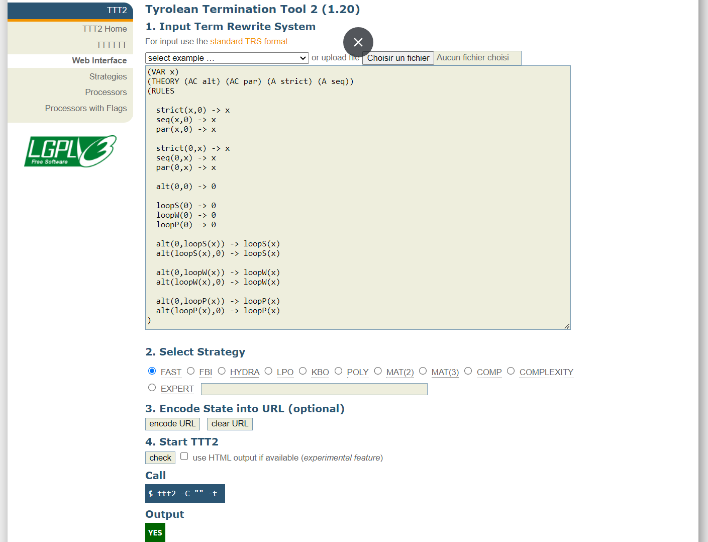
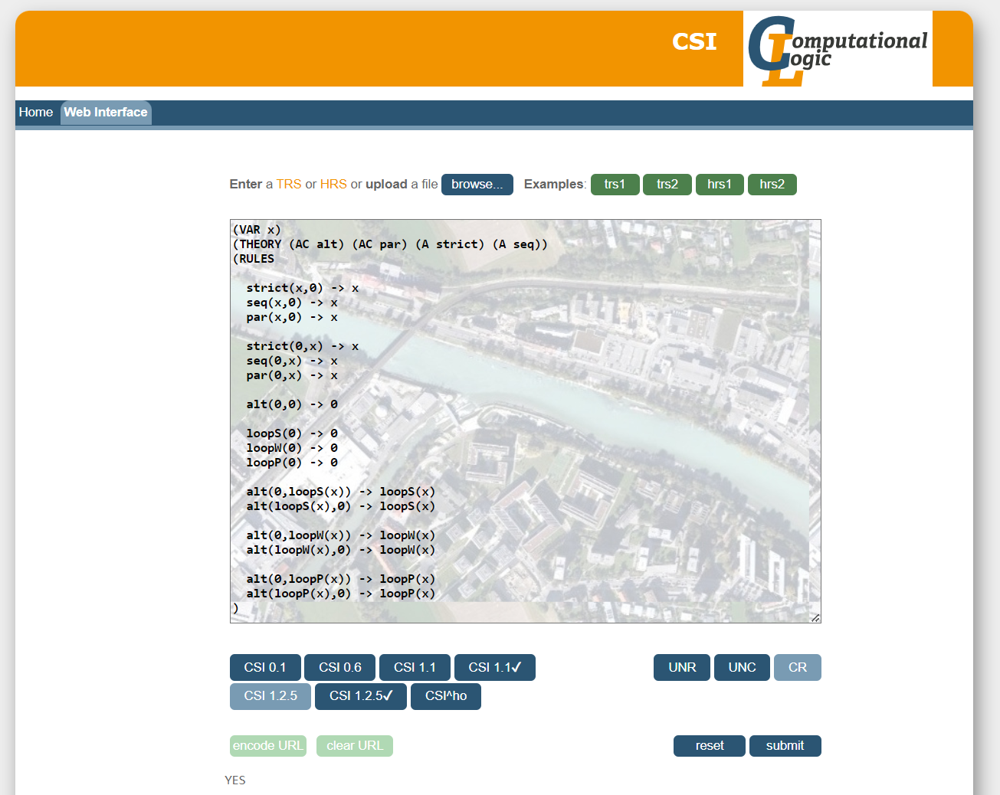

# Proof of the convergence of a Term Rewrite System to simplify Interaction terms


Interactions encode as binary tree terms behavioral models similar to Message Sequence Charts and UML Sequence Diagrams.
They are associated with a trace semantics which can be defined equivalently in operational and denotational style
( see [this paper](https://link.springer.com/chapter/10.1007/978-3-031-10363-6_8)).

[HIBOU](https://github.com/erwanM974/hibou_efm) implements various features to manipulate interactions.
One such feature concerns interaction execution i.e., given an initial interaction *i*
computing a follow-up term *i'* resulting from the execution of action *a* in *i*.
This execution can be complemented with on-the-fly term simplification so that term *i'* is kept simple.

In this repository we present some trivial simplifications which implementation equates the application of a
Term Rewrite System which we prove to be convergent in the following.

## Definition of the Term Rewrite System

The aim of those basic simplifications is to remove redundant empty interaction sub-terms that may appear
due to the execution of actions or the pruning of parts of the interaction (the pruning or permission relation
allows implementing weak sequencing).

Each basic simplification corresponds to a rewrite rules.
The resulting Term Rewrite System is encoded in WST format (international WorkShop on Termination,
see [HIBOU](termination-portal.org/wiki/WST)) below:

```
(VAR x)
(THEORY (AC alt) (AC par) (A strict) (A seq))
(RULES

strict(x,0) -> x  
seq(x,0) -> x  
par(x,0) -> x

strict(0,x) -> x  
seq(0,x) -> x  
par(0,x) -> x

alt(0,0) -> 0

loopS(0) -> 0  
loopW(0) -> 0  
loopP(0) -> 0

alt(0,loopS(x)) -> loopS(x)
alt(loopS(x),0) -> loopS(x)

alt(0,loopW(x)) -> loopW(x)
alt(loopW(x),0) -> loopW(x)

alt(0,loopP(x)) -> loopP(x)
alt(loopP(x),0) -> loopP(x)
)
```

Given variable `x`, each line in `(RULES ...)` corresponds to the application of a rule.
Some operators of the language are associative and/or commutative.
We declare this in `(THEORY ...)` with, for instance 
the non-deterministic choice `alt` operator being associative and commutative `AC`
and the weak sequencing `seq` operator being only associative `A`.


Classical Term Rewriting allows the application of rewrite rules modulo substitution of variables
and application at any position in the term.
This enables e.g. `seq(x,loopS(0)) -> seq(x,0) -> x` by applying 
rule 8 at position 1 within the initial term
and then rule 2 at the root position.


With Associative-Commutative Rewriting, we can also apply those rewrite rules modulo the equivalence classes
defined by the THEORY made of the rules
`f(x,y) <-> f(y,x)` for commutative operators
and `f(x,f(y,z)) <-> f(f(x,y),z)` for associative operators.
For instance, this allows the transformation `alt(alt(0,x),alt(y,0)) -> alt(x,alt(y,0))`.


As each rewrite rule corresponds to an algebraic property of the corresponding operators,
they each preserve the trace semantics of interactions.
This then implies that the application of the TRS preserves the semantics.
Hence, any two terms that can be related by the application of the TRS are semantically equivalent.


## Convergence

Convergence of a TRS *->* makes so that, for any term *t*, there exists a unique irreducible term *t'* 
(i.e. a term that cannot be rewritten anymore) such that *t -\*>t'*.

In order to prove convergence, it suffices to prove termination and confluence.

The termination and confluence of TRS can be proven using several
publicly available tools:
- the TTT2 tool (version 1.20), which web interface is available
[here](http://colo6-c703.uibk.ac.at/ttt2/web/) enables proving termination
- the CSI tool (version 1.2.5) which web interface is available
  [here](http://colo6-c703.uibk.ac.at/csi/) enables proving confluence

It suffices to provide them with the WST encoding of the TRS and configure them appropriately.

The output of TTT2 is the following, proving termination:



The output of CSI is the following, proving confluence:




